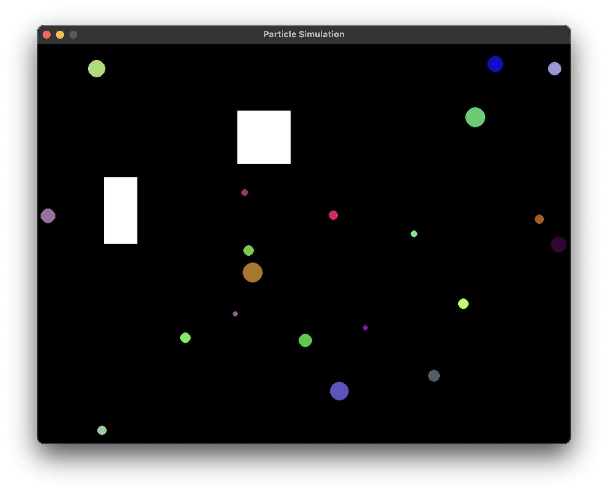

# Particle Simulator

This is my second project using **Pygame**, where I've created a particle simulation to explore and apply physics principles to a dynamic environment. The project started as a weekend experiment, but has evolved significantly over time. It now includes features such as particle collisions, obstacles, and visual variations in particle size, mass, and behavior.

## Motivation
Originally, the goal was to better understand how physics simulations could be built in Python and Pygame. Over time, this project has grown into a more complex simulator where I experimented with different mechanics, such as:
- Particle collisions with other particles and obstacles.
- Variations in particle size, velocity, and mass.
- Implementing realistic behaviors like bouncing off walls and interacting with obstacles.

## Features
- **Particle Collision Handling**: Particles collide with each other based on their radius and resolve using basic physics rules.
- **Obstacle Interaction**: Particles detect and react to obstacles placed on the screen.
- **Variable Particle Properties**: Each particle has a randomized size, mass, and color to create a dynamic simulation.
- **Configurable Simulation Settings**: Easily change the number of particles, screen size, and other properties in `settings.py`.
- **Visual Dynamics**: Particles vary in size and color, making the simulation visually interesting.

## How to Run
1. Clone the repository:
   ```bash
   git clone https://github.com/your-repo-url/particle-simulator.git
   cd particle-simulator

2. Install dependencies:
    ```bash
    pip install -r requirements.txt

3. Run the simulation:
    ```bash
    python main.py


## Simulation details
- **Particle dynamics**: Each particle has a velocity and mass, which affect how it moves and interacts with other particles.
- **Obstacles**: You can customize the number and position of obstacles within the simulation. Obstacles are immovable objects that particles bounce off of when they come into contact.
- **Collision Handling**: The simulation checks for collisions between particles and obstacles, resolving them by reversing velocities based on particle mass and size.

## Screenshots


## Technologies Used
- **Python**: Core programming language for the logic.
- **Pygame**: Library for rendering graphics and handling input events.

## Contributing
Feel free to fork the repository and contribute to improving this simulation. I welcome suggestions for new features or optimizations.

